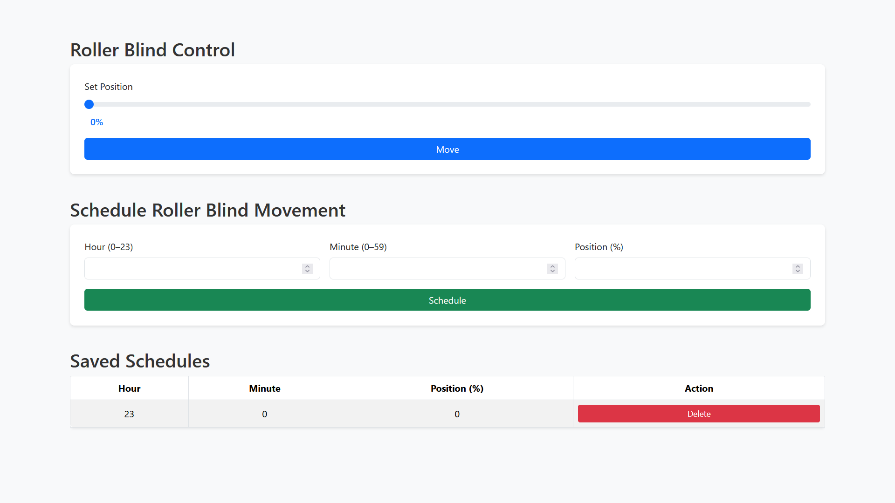
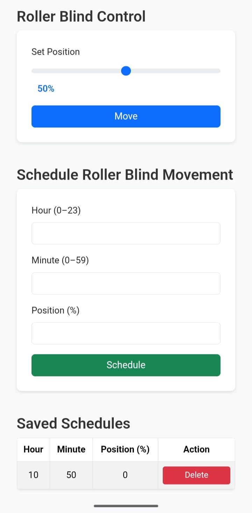

# auto-blinds

**ESP32 + Flask to control and automate roller blinds**

Control and automate your roller blinds using an ESP32 microcontroller and a Flask-based web interface. Supports both manual control and scheduled automation from any device on your network.

---

## Features

- Manual control via web interface
- Automated scheduling
- Lightweight and fast
- Runs on ESP32 with minimal hardware requirements




---

## Hardware

- ESP32 Dev Board
- NEMA17 stepper motor
- A4988 driver
- Power supply: 12V, 1.5A (18W)
- Connecting wires


---
## Software

- Arduino IDE (for ESP32 firmware)
- Python 3.x
- Flask (web interface)

---

## Quick Setup

### 1. Clone the repository
```bash
git clone https://github.com/Lody-dev/auto-blinds.git
cd auto-blinds
```

### 2. Set up the ESP32
- Open `firmware/firmware.ino` in Arduino IDE.  
- Update Wi-Fi credentials.  
- Upload firmware to ESP32.  
- Open serial monitor at 115200 baud to verify connection.  
- If the ESP32 connects successfully, note its local IP address for the Flask server configuration.  
- If connection fails, double-check Wi-Fi credentials in `firmware.ino`.

### 3. Set up Flask server
```bash
cd server
python3 -m venv venv
source venv/bin/activate       # On Windows: venv\Scripts\activate
pip install -r requirements.txt
python app.py
```
- Flask server runs on `http://localhost:5000` by default.  
- Set the `ESP32_IP` variable in the server code to your ESP32’s local IP address.

### 4. Control your blinds
- Open the web interface at `http://localhost:5000` (or `http://<server-ip>:5000` from another device).  
- Use manual controls or configure automation schedules.

---

## Folder Structure

```
auto-blinds/
├─ firmware/    # ESP32 firmware
├─ server/      # Flask backend
├─ README.md
└─ requirements.txt
```

---
